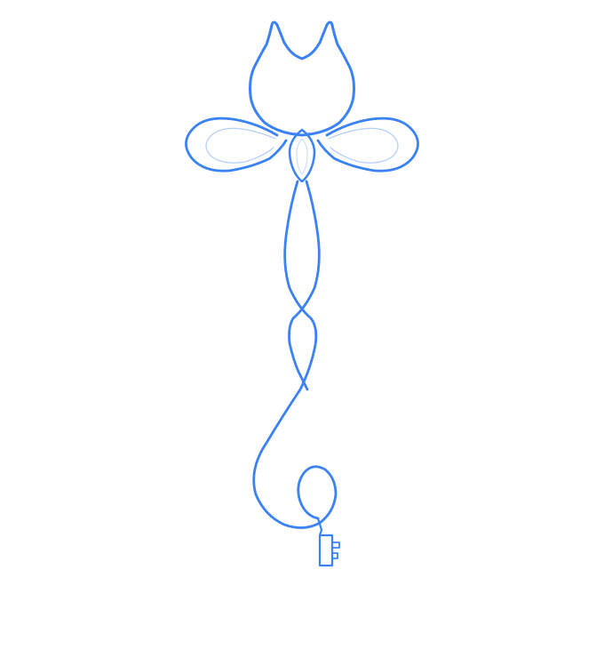
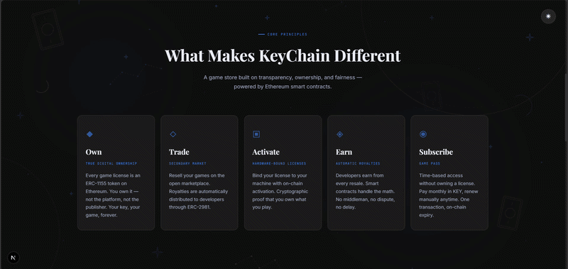
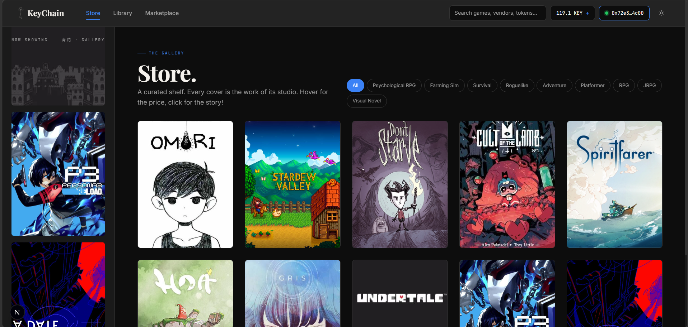
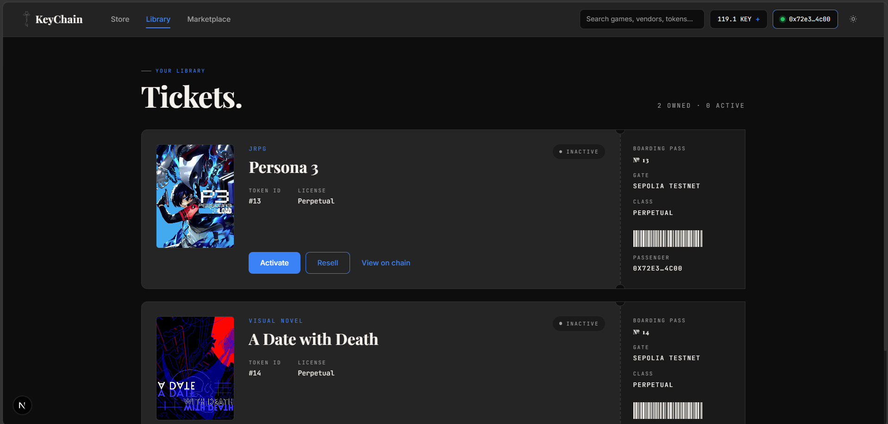
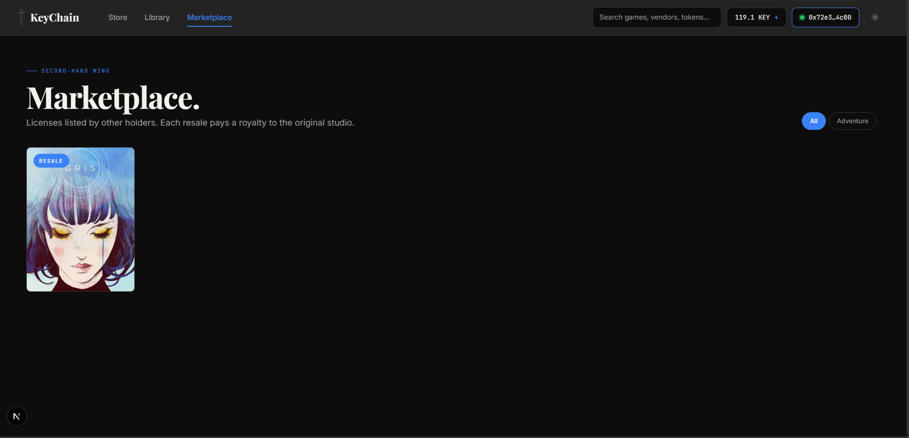
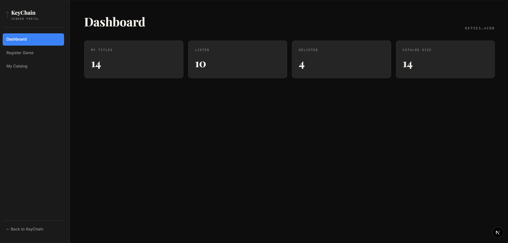
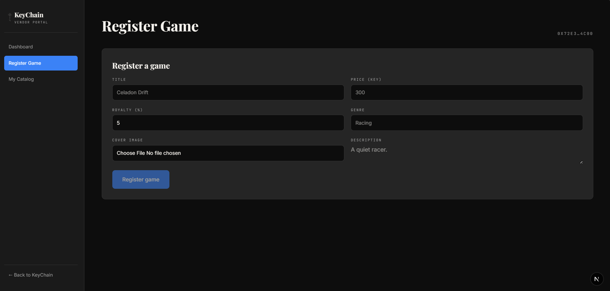
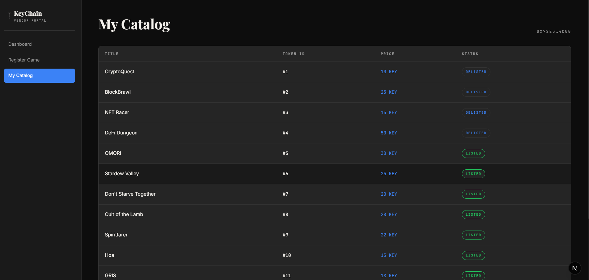

<p align="center">
  
</p>

<h1 align="center">KeyChain</h1>

<p align="center"><em>Mỗi giấy phép là một chiếc chìa khóa, mọi giao dịch đều on-chain.</em></p>

<p align="center">
  
  
  
  
  
</p>

<p align="center">
  
  
  
  
  
  
  
</p>

<p align="center">
  <a href="#trải-nghiệm-nhanh-trên-sepolia">Trải nghiệm nhanh</a> ·
  <a href="#kiến-trúc-hệ-thống">Kiến trúc</a> ·
  <a href="#phân-tích-bảo-mật">Bảo mật</a>
</p>

KeyChain là một nền tảng thử nghiệm phân phối và quản lý bản quyền game phi tập trung trên Ethereum.

KeyChain token hóa mỗi giấy phép game thành một chứng chỉ on-chain theo chuẩn ERC-1155, kiểm soát quyền truy cập bằng smart contract, và mở ra một thị trường mua bán lại với cơ chế tự động chia tiền bản quyền cho nhà phát hành theo chuẩn ERC-2981.

---

## Mục lục

- [Bối cảnh và vấn đề](#bối-cảnh-và-vấn-đề)
- [Tính năng chính](#tính-năng-chính)
- [Hình ảnh minh họa](#hình-ảnh-minh-họa)
- [Kiến trúc hệ thống](#kiến-trúc-hệ-thống)
- [Yêu cầu môi trường](#yêu-cầu-môi-trường)
- [Cài đặt](#cài-đặt)
- [Trải nghiệm nhanh trên Sepolia](#trải-nghiệm-nhanh-trên-sepolia)
- [Cách kiểm thử](#cách-kiểm-thử)
- [Tự deploy lên Sepolia](#tự-deploy-lên-sepolia)
- [Phân tích bảo mật](#phân-tích-bảo-mật)
- [Hạn chế đã biết](#hạn-chế-đã-biết)

---

## Bối cảnh và vấn đề

Các nền tảng phân phối game tập trung như Steam hay Epic Games có ba vấn đề cốt lõi:

1. Người dùng không thực sự sở hữu thứ mình đã mua.
2. Người dùng không được phép bán lại giấy phép số một cách hợp pháp.
3. Nhà phát triển không nhận được doanh thu nào từ giao dịch trên thị trường thứ cấp.

KeyChain giải quyết bằng cách đưa trạng thái sở hữu, kiểm soát truy cập và logic bản quyền lên blockchain, loại bỏ nhu cầu tin tưởng vào một nền tảng trung gian.

Tiền lệ pháp lý: vụ *UsedSoft v. Oracle (2012)* đã xác lập rằng giấy phép phần mềm số có thể được bán lại.

---

## Tính năng chính

- **Mua KeyCoin (KEY)**: token thanh toán nội bộ ERC-20. Người dùng nạp ETH để nhận KEY, sau đó dùng KEY mua giấy phép.
- **Mua giấy phép game**: mỗi giấy phép là một GameToken ERC-1155. Sở hữu token nghĩa là sở hữu game.
- **Kích hoạt theo thiết bị**: gắn giấy phép với một máy cụ thể thông qua `machineHash`. Giấy phép đang kích hoạt không thể bán lại cho tới khi hủy kích hoạt.
- **Bán lại trên Marketplace**: đăng bán giấy phép; khi có người mua, tiền bản quyền tự động về nhà phát hành (ERC-2981), phần còn lại về người bán.
- **Game Pass**: giấy phép thuê bao theo tháng, gia hạn thủ công.
- **Vendor Portal**: nhà phát hành tự đăng game, đặt giá, theo dõi doanh thu.
- **RBAC on-chain**: bốn vai trò Admin / Vendor / Minter / Customer kiểm soát bằng OpenZeppelin AccessControl.

---

## Hình ảnh minh họa

> Đặt media vào thư mục `frontend/public/screenshots/` rồi cập nhật đường dẫn bên dưới. Trang chủ dùng GIF, các trang còn lại dùng ảnh PNG.

**Trang chủ (Landing)**



**Cửa hàng (Store)**



**Thư viện (Library)**



**Chợ giao dịch (Marketplace)**



**Cổng nhà phát hành (Vendor Portal)**






---

## Kiến trúc hệ thống

KeyChain gồm 6 smart contract, deploy tuần tự theo thứ tự phụ thuộc:

| # | Contract | Chuẩn | Trách nhiệm |
|---|---|---|---|
| 1 | `KeyCoin.sol` | ERC-20 + AccessControl | Token thanh toán nội bộ. `buyKeyCoin()` nhận ETH và mint KEY theo tỉ giá cấu hình. |
| 2 | `GameToken.sol` | ERC-1155 + ERC-2981 + AccessControl | Token giấy phép. Mỗi `tokenId` là một game. `royaltyInfo()` trả về địa chỉ vendor và tỉ lệ bản quyền. |
| 3 | `ActivationContract.sol` | Custom | Quản lý trạng thái kích hoạt, gắn giấy phép với thiết bị qua `machineHash`. |
| 4 | `GameStore.sol` | Custom + ReentrancyGuard | Danh mục game. `registerGame()` (vendor), `purchaseLicense()` chuyển KEY và mint GameToken. |
| 5 | `Marketplace.sol` | Custom + ReentrancyGuard | Thị trường thứ cấp. Tự chia bản quyền cho vendor, phần còn lại cho người bán. |
| 6 | `GamePass.sol` | Custom | Thuê bao theo tháng. `subscribe(gameId, months)` chuyển KEY và đặt hạn dùng. |

Thứ tự deploy:

```
KeyCoin -> GameToken -> ActivationContract -> GameStore -> Marketplace -> GamePass
```

**Cấu trúc thư mục:**

```
KeyChain/
├── blockchain/
│   ├── contracts/          # 6 smart contract Solidity
│   ├── test/               # Unit test + integration/ (3 kịch bản)
│   ├── scripts/            # deploy.ts, setup-roles.ts, seed-games.ts, verify.ts
│   ├── deployments/        # sepolia.json gồm 6 địa chỉ contract
│   └── hardhat.config.ts
├── frontend/
│   ├── src/app/            # Các trang Next.js: /, /store, /library, /marketplace, /vendor
│   ├── src/components/     # layout, ui, game, library, marketplace, vendor
│   ├── src/hooks/          # useWallet, useKeyCoin, useGameStore, useActivation, ...
│   ├── src/providers/      # WalletProvider, ContractProvider, ThemeProvider, ToastProvider
│   ├── src/lib/            # contracts.ts, ipfs.ts, machineHash.ts, format.ts
│   └── src/abi/            # ABI biên dịch từ blockchain
```

---

## Yêu cầu môi trường

- Node.js 18 trở lên và npm
- MetaMask cài trên trình duyệt
- Sepolia ETH để trả gas có thể xin miễn phí ở faucet hoặc đào, xem bên dưới

Để tự deploy lại contract, cần thêm:
- Alchemy API Key (RPC tới Sepolia)
- Etherscan API Key (verify contract)
- Pinata JWT + Gateway (upload ảnh/metadata game)

---

## Cài đặt

Clone repo và cài dependency cho cả hai phần:

```bash
git clone https://github.com/kkhanh-kas/KeyChain.git
cd KeyChain

# Cài cho blockchain
cd blockchain
npm install

# Cài cho frontend
cd ../frontend
npm install
```

---

## Trải nghiệm nhanh trên Sepolia

Hệ thống đã được deploy sẵn và seed đầy đủ game trên Sepolia. Chỉ cần trỏ frontend vào các địa chỉ contract có sẵn là chạy được ngay, không cần deploy lại.

**Bước 1: Tạo file cấu hình frontend**

```bash
cd frontend
cp .env.example .env.local
```

**Bước 2: Điền `frontend/.env.local`** với 6 địa chỉ contract đã deploy:

```env
NEXT_PUBLIC_ALCHEMY_RPC=https://eth-sepolia.g.alchemy.com/v2/ALCHEMY_API_KEY_CUA_BAN
NEXT_PUBLIC_CHAIN_ID=11155111

NEXT_PUBLIC_KEYCOIN_ADDRESS=0xeC1C90759b7EBd37D27D738cFb91daa17DD0207B
NEXT_PUBLIC_GAMETOKEN_ADDRESS=0x85626dD3B6A3144075D2de017979b371Fad43e18
NEXT_PUBLIC_GAMESTORE_ADDRESS=0x1eb24DD126a513D788abd8BB86C0572e13Cf180E
NEXT_PUBLIC_ACTIVATION_ADDRESS=0xA02A84743e6A3Dd5297C6e585b860E60a63ee4eD
NEXT_PUBLIC_MARKETPLACE_ADDRESS=0x966a48B5D08c06A99d8f36dFa51c62b404C6e610
NEXT_PUBLIC_GAMEPASS_ADDRESS=0x3Fc0ECce01E0EE6318592A788337063415484343

# Pinata chỉ cần khi muốn đăng game mới qua Vendor Portal
PINATA_JWT=jwt_token_cua_ban
PINATA_GATEWAY=ten-gateway-cua-ban.mypinata.cloud
```

**Bước 3: Chạy app**

```bash
npm run dev
```

Mở http://localhost:3000, chuyển MetaMask sang mạng **Sepolia**, kết nối ví.

**Bước 4: Xin Sepolia ETH nếu ví chưa có:**
- Faucet thường: https://www.alchemy.com/faucets/ethereum-sepolia
- PoW faucet (đào ETH bằng proof-of-work ngay trên trình duyệt, không cần điều kiện): https://sepolia-faucet.pk910.de/, cảm ơn [pk910](https://github.com/pk910/PoWFaucet) đã làm faucet này ദ്ദി(˵ •̀ ᴗ - ˵ ) ✧

**Địa chỉ contract trên Sepolia:**

| Contract | Địa chỉ | Etherscan |
|---|---|---|
| KeyCoin | `0xeC1C90759b7EBd37D27D738cFb91daa17DD0207B` | [Xem](https://sepolia.etherscan.io/address/0xeC1C90759b7EBd37D27D738cFb91daa17DD0207B#code) |
| GameToken | `0x85626dD3B6A3144075D2de017979b371Fad43e18` | [Xem](https://sepolia.etherscan.io/address/0x85626dD3B6A3144075D2de017979b371Fad43e18#code) |
| GameStore | `0x1eb24DD126a513D788abd8BB86C0572e13Cf180E` | [Xem](https://sepolia.etherscan.io/address/0x1eb24DD126a513D788abd8BB86C0572e13Cf180E#code) |
| ActivationContract | `0xA02A84743e6A3Dd5297C6e585b860E60a63ee4eD` | [Xem](https://sepolia.etherscan.io/address/0xA02A84743e6A3Dd5297C6e585b860E60a63ee4eD#code) |
| Marketplace | `0x966a48B5D08c06A99d8f36dFa51c62b404C6e610` | [Xem](https://sepolia.etherscan.io/address/0x966a48B5D08c06A99d8f36dFa51c62b404C6e610#code) |
| GamePass | `0x3Fc0ECce01E0EE6318592A788337063415484343` | [Xem](https://sepolia.etherscan.io/address/0x3Fc0ECce01E0EE6318592A788337063415484343#code) |

Tỉ giá: **1 ETH = 1000 KEY** (nạp 0.05 ETH nhận 50 KEY). Giá game: 12–45 KEY.

### Luồng trải nghiệm end-to-end

1. **Kết nối ví**: bấm Connect Wallet trên thanh điều hướng, chọn ví Sepolia.
2. **Mua KEY**: bấm chip số dư KEY, nhập số ETH, xác nhận trên MetaMask.
3. **Mua game**: vào Store, chọn game, approve KEY rồi mua. Game về Library.
4. **Kích hoạt**: vào Library, mở giấy phép, bấm Activate (gắn machineHash vào thiết bị).
5. **Bán lại**: ở Library bấm Deactivate trước, sang Marketplace đăng bán; ví khác mua thì tiền bản quyền tự về vendor, kích hoạt tự reset.
6. **Game Pass**: với game có pass, bấm Subscribe theo tháng và kiểm tra hạn dùng.

> Khách hàng (mua / kích hoạt / bán lại) **không cần cấp role**, chỉ cần ví có Sepolia ETH.

### Reset về trạng thái sạch để trải nghiệm lại

Đây là Sepolia, một testnet công khai chứ không phải mạng local, nên **không có nút reset blockchain**: giấy phép đã mua nằm vĩnh viễn trong ví. Có hai cách đưa demo về trạng thái sạch.

**Cách 1: Dùng account mới (sạch hoàn toàn, khuyến nghị).** Đây là cách duy nhất cho trạng thái "trước khi mua bất cứ thứ gì":

1. MetaMask, mở menu account rồi bấm **Add account** để tạo account mới.
2. Gửi cho account mới khoảng **0.1 Sepolia ETH** (từ faucet, hoặc chuyển từ account chính).
3. Kết nối account mới: ví giờ có **0 KEY, 0 game, 0 kích hoạt**, sạch tinh.
4. Diễn lại luồng trải nghiệm từ đầu.

> Mẹo: tạo sẵn vài account demo để xoay vòng, khỏi phải xin faucet mỗi lần •⩊•

**Cách 2: Reset từng phần trên cùng ví (nhanh, để diễn lại một bước).**

| Muốn diễn lại | Làm gì | Ở đâu |
|---|---|---|
| Kích hoạt | Bấm **Deactivate** giấy phép trước | Library |
| Bán lại | Đăng bán rồi cho ví khác mua | Marketplace |
| Số dư KEY thấp | Mua thêm KEY | chip KEY ở Navbar |

KEY đã mua giữ nguyên, mua thêm nếu cần. Giấy phép đã mua **không xóa được** trên cùng ví. Muốn về trạng thái "chưa từng mua" thì dùng Cách 1.

---

## Cách kiểm thử

Toàn bộ lệnh test chạy trong thư mục `blockchain/`.

**Unit test (6 contract):**

```bash
cd blockchain
npm test
```

**Đo độ phủ (coverage):**

```bash
npm run test:coverage
```

Mục tiêu: statement coverage ≥ 95%, branch coverage ≥ 80%.

**Integration test (3 kịch bản end-to-end):**

Ba kịch bản nằm trong `blockchain/test/integration/` và chạy cùng `npm test`:
- `happy-path.test.ts`: ETH → KEY → mua game → kích hoạt.
- `secondary-market.test.ts`: mua → kích hoạt → đăng bán → người khác mua → bản quyền tự chia → kích hoạt reset.
- `game-pass.test.ts`: subscribe → hết hạn → gia hạn.

**Test frontend:**

```bash
cd frontend
npm test
```

**Phân tích tĩnh contract (tùy chọn, cần cài Slither):**

```bash
cd blockchain
slither . --filter-paths "node_modules|artifacts|cache|test"
```

---

## Tự deploy lên Sepolia

Chỉ cần làm khi muốn deploy một bộ contract mới. Code và script đã viết sẵn, chỉ điền key vào `.env` rồi chạy 4 lệnh.

**Bước 1: Tạo `blockchain/.env`:**

```bash
cd blockchain
cp .env.example .env
```

Điền 3 key:

```env
ALCHEMY_API_KEY=chi_phan_key_khong_phai_url
DEPLOYER_PRIVATE_KEY=0xprivate_key_vi_deploy
ETHERSCAN_API_KEY=etherscan_key_cua_ban
```

> Dùng một ví **chỉ dành cho testnet**. 

**Bước 2: Compile và deploy:**

```bash
npm run compile
npm run deploy:sepolia     # in ra 6 địa chỉ + ghi deployments/sepolia.json
```

**Bước 3: Cấp quyền và seed game:**

```bash
npm run setup-roles        # điền địa chỉ vendor vào scripts/setup-roles.ts trước
npm run seed               # đăng game demo (tự skip game đã có)
```

**Bước 4: Verify trên Etherscan:**

```bash
npm run verify
```

**Bước 5: Cập nhật `frontend/.env.local`** với 6 địa chỉ mới rồi chạy `npm run dev`.

---

## Phân tích bảo mật

Dự án dùng **Slither** để phân tích tĩnh trên toàn bộ contract. Slither quét và phát hiện một số vấn đề, đã được xem xét và xử lý:

| Mức độ | Số lượng | Ghi chú |
|---|---|---|
| High | 1 | `withdraw()` trong KeyCoin thiếu kiểm soát quyền, đã bổ sung giới hạn quyền admin. |
| Medium | 0 | — |
| Low | 2 | shadowing tên biến và phụ thuộc `block.timestamp` trong GamePass, rủi ro thấp, chấp nhận được. |
| Informational | 2 | low-level call và khai báo kế thừa interface, mang tính khuyến nghị. |

Các biện pháp phòng vệ chính:

| Mối đe dọa | Biện pháp |
|---|---|
| Reentrancy | Checks-Effects-Interactions + `ReentrancyGuard` trên `purchaseLicense()`, `buyLicense()`. |
| Kích hoạt trái phép | Kiểm tra `balanceOf(msg.sender, tokenId) > 0`: chỉ chủ giấy phép mới kích hoạt được. |
| Truy cập trái phép | `onlyRole()` trên mọi hàm thay đổi trạng thái. |
| Tràn số | Solidity ≥ 0.8 có kiểm tra tràn số sẵn. |

---

## Hạn chế đã biết

- Thời gian xác nhận block (~12 giây) ảnh hưởng trải nghiệm khi kích hoạt.
- Bắt buộc dùng MetaMask, rào cản với người không quen crypto.
- KEY là token nội bộ đơn giản, không neo giá theo tiền pháp định.
- Metadata trên IPFS không có cam kết pin vĩnh viễn (Pinata gói miễn phí).
- ERC-2981 chỉ mang tính khuyến nghị, Marketplace của KeyChain thực thi bản quyền nhưng marketplace bên ngoài có thể không.
- Chuyển ERC-1155 trực tiếp giữa hai ví sẽ bỏ qua Marketplace, không thu được bản quyền và không reset kích hoạt.

---

